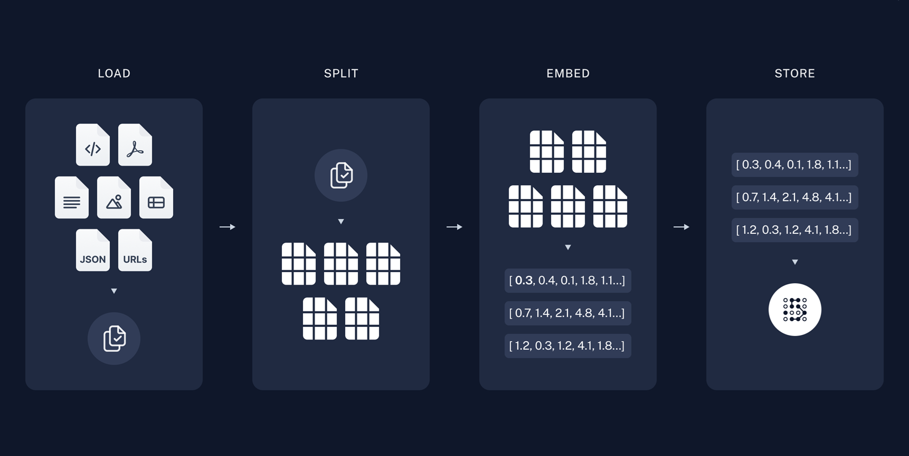
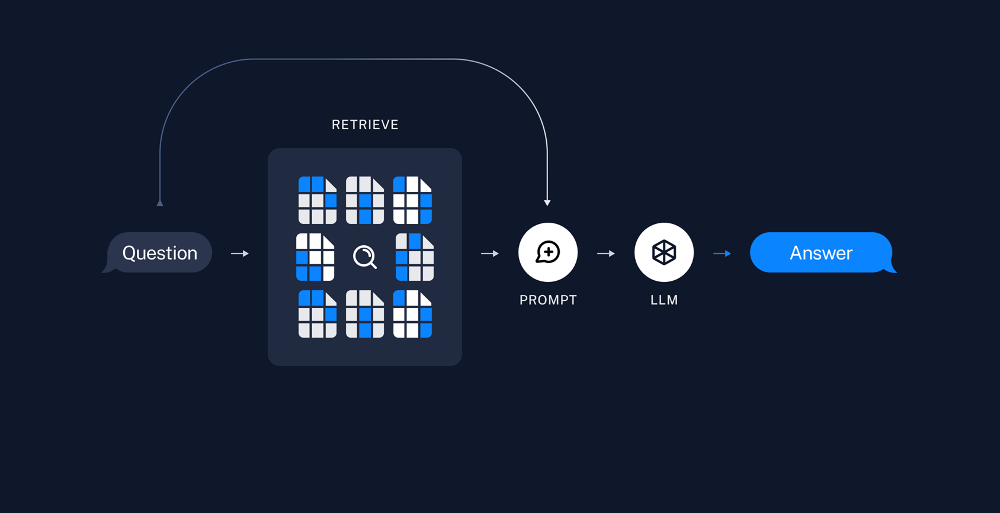

# 📑Introduction

## Document-Based RAG-LangChain Chatbot
This repository contains a fully local Retrieval-Augmented Generation (RAG) chatbot that indexes PDFs, plain text (.txt), and CSV files, retrieves relevant context, and generates grounded answers with LangChain via a Streamlit UI. Because it runs entirely on your machine—with no cloud services or external APIs—it’s well-suited for private data and air-gapped environments.


*****


# 🔍RAG Description

## What is RAG-LangChain?
RAG-LangChain is a practical framework that combines Retrieval-Augmented Generation (RAG) with LangChain to build applications that are more accurate, context-aware, and reliable. Instead of relying solely on a model’s pre-trained knowledge, it retrieves relevant information from external sources—such as documents, databases, and APIs—at query time and then generates an answer. This retrieval-first workflow improves accuracy, reduces hallucinations, and makes responses easier to trace and explain.

## How RAG Works



1. Documents are preprocessed, chunked, and embedded with an embedding model. The resulting vectors capture the semantic meaning of the text.
2. When a user asks a question, the question is embedded into the same vector space and the most relevant chunks are retrieved by semantic similarity.



3. The retrieved passages are appended to the prompt, augmenting the user’s query with additional context for the model.
4. The large language model (LLM) then generates a response grounded in both the user’s question and the retrieved context.

 > (images from https://python.langchain.com/docs/tutorials/rag/)


*****


# 🔨Getting Started

## 1. Verify Your Environment
 * ~24 GB VRAM recommended for an ~3B-parameter LLM (24 GB+ for larger models)
 * GPU acceleration
 * Python 3.11+

## 2. Libraries and Dependencies
```bash
git clone https://github.com/gyb357/langchain_chatbot
pip install -r requirements.txt
```

## 3. Download LLMs and Managing Configuration
Browse Hugging Face to find and download models appropriate for your task.
 > 🤗 Huggingface: https://huggingface.co/models

This RAG system runs locally, and both the embedding model and LLM are configured via `config.yaml`.
exam:
```yaml
embed_model: "jhgan/ko-sroberta-multitask"
llm: "kakaocorp/kanana-1.5-2.1b-instruct-2505"
```


*****

