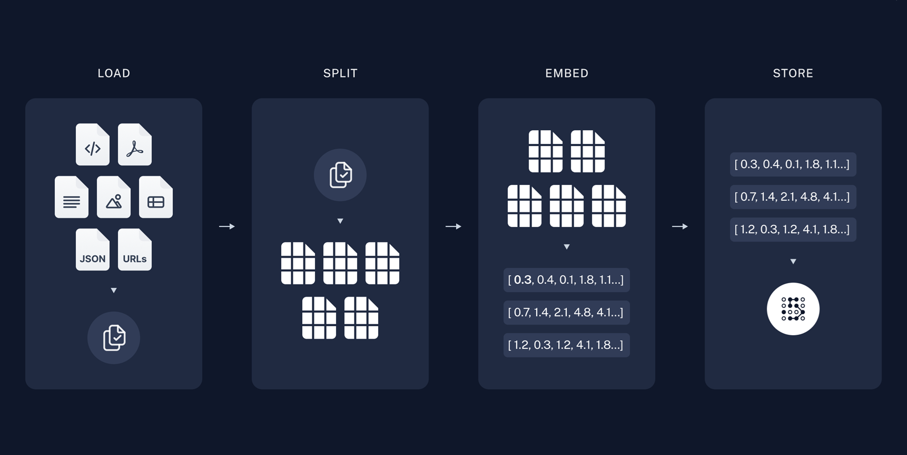
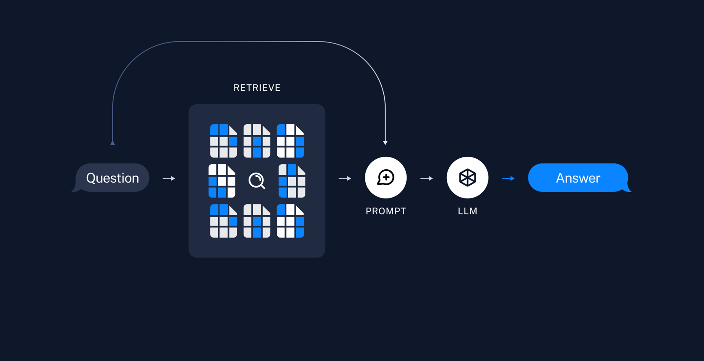

# Table of Contents
1. [Introduction](#1-Introduction)
> - Document-based RAG-LangChain Chatbot
> - Purpose

2. [RAG Description](#2-RAG-Description)
> - What is RAG?
> - How RAG Works

3. [Key Features](#3-Key-Features)

4. [Getting Started](#4-Getting-Started)
> - Running Environment
> - Libraries and Dependencies
> - Downloading Embedding and LLM Models
> - Managing config

5. [Project Structure](#5-Project-Structure)

*****


# Introduction

## 📑 Document-based RAG-LangChain Chatbot
This repository implements a RAG (Retrieval-Augmented Generation) based chatbot system that runs entirely in a local environment. It processes various document formats such as PDF, TXT, and CSV to answer questions using the LangChain framework and provides an intuitive interface through Streamlit. The system is designed to work without relying on external services, making it suitable for private or sensitive data applications.

## Purpose
This repository was created to test the simple techniques involved in implementing Ganlangchain and RAG in a local environment.


## 💡 What is RAG?
RAG is a hybrid AI framework that combines the power of retrieval systems with generative language models to create more accurate, reliable, and contextually relevant responses.



## How RAG Works:
 - **Document Indexing**: First, documents are processed, chunked, and converted into vector embeddings using embedding models. These vectors capture the semantic meaning of text.
 - **Retrieval**: When a user asks a question, the system converts the question into the same vector space and retrieves the most relevant document chunks based on semantic similarity.
 - **Augmentation**: The retrieved context is then "augmented" to the user's query as additional context for the language model.
 - **Generation**: Finally, the large language model (LLM) generates a response based on both the user's question and the retrieved document context.



(images from https://python.langchain.com/docs/tutorials/rag/)


## ✨ Key Features
 - Process and extract data from various document formats (PDF, TXT, CSV)
 - Build efficient search indices through document chunking and vectorization
 - Implement RAG-based question answering system
 - Configure LLM prompt chains using LangChain
 - Interactive web interface with Streamlit
 - Download and use embedding models and LLMs from Hugging Face


# Getting Started

## Environment
 - Python 3.9+
 - 16GB+ RAM recommended (32GB+ for larger models)
 - GPU acceleration (optional but recommended for performance)


## Clone the repository and install the required dependencies:
```bash
git clone https://github.com/gyb357/langchain_chatbot
pip install -r requirements.txt
```


## Downloading Embedding Models and LLMs from Hugging Face
To run this RAG system locally, embedding models and large language models (LLMs) are managed via config.yaml. Instead of manually specifying models in the code, you can define their names in the configuration file. This allows for flexible model switching without modifying the source code.


## Managing Models in config.yaml
 > Inside ```config/config.yaml```, specify the embedding model and LLM model as follows:
```yaml
embedding_model: "sentence-transformers/all-MiniLM-L6-v2"
llm_model: "mistralai/Mistral-7B-Instruct-v0.1"
```

For other models, check Hugging Face Model Hub and replace model_name accordingly.

🤗 Huggingface site: https://huggingface.co/models

You can set a variety of other fine-grained settings in config.yaml.


## Launching the Web Interface with Streamlit
This is includes a Streamlit application for a user-friendly interface to interact with the RAG system.

```bash
streamlit run app.py
```

After running this command, the application will be available at http://localhost:8501 by default. You can access the interface through your web browser.

or

```bash
streamlit run [app.py] [--server.port 'Port number you want']
```


# Project Structure

```bash
langchain_chatbot
├── app.py                      # Streamlit web application (main)
├── vectorstore/
│   └── vector_db.py            # Vector store related code
├── config/
│   └── config.yaml             # Configuration file
├── requirements.txt            # Dependency package list
└── README.md                   # Project documentation
```


