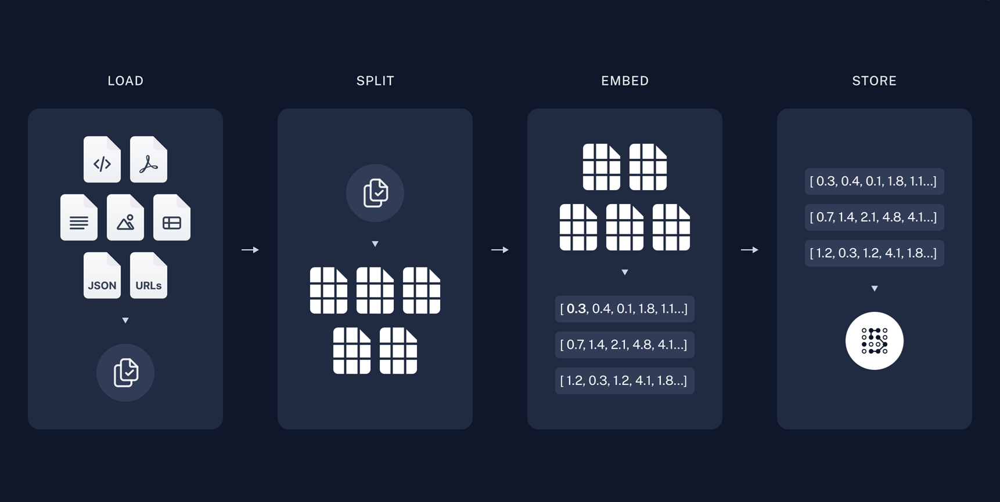
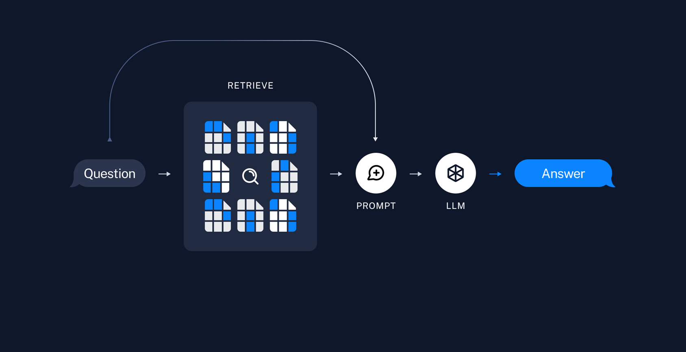

# 📑Introduction

## Document-Based RAG-LangChain Chatbot
This repository implements a Retrieval-Augmented Generation (RAG) based chatbot system that runs entirely in a local environment. It processes various document formats such as PDF and TXT to answer questions using the LangChain framework and provides an intuitive interface through Streamlit. The system is designed to work without relying on external services, making it suitable for private or sensitive data applications.

## Purpose of the Project
This repository is focused on implementing LangChain and RAG in a local environment and testing simple techniques related to them.

 > [!Note]
 > Testing will primarily be conducted on the dev branch. Once stable, changes will be merged into the main branch.


*****


# ✨Key Features
 * Process and extract data from various document formats (PDF, TXT)
 * Download and use embedding models and LLMs from Hugging Face
 * Build efficient search indices through document chunking and vectorization
 * Implement a RAG-based question-answering system
 * Configure LLM prompt chains using LangChain
 * Interactive web interface with Streamlit


*****


# 🔍RAG Description

## What is RAG-LangChain?
RAG-LangChain is an advanced AI framework that combines Retrieval-Augmented Generation (RAG) with LangChain, enabling more accurate, context-aware, and reliable AI-powered applications. Unlike traditional language models that generate responses solely based on their pre-trained knowledge, RAG-LangChain dynamically retrieves relevant information from external sources—such as documents, databases, and APIs—before generating answers. This approach significantly improves accuracy, reduces hallucinations, and enhances the explainability of responses.

## How RAG Works



1. Documents are processed, chunked, and converted into vector embeddings using embedding models. These vectors capture the semantic meaning of text.
2. When a user asks a question, the system converts the question into the same vector space and retrieves the most relevant document chunks based on semantic similarity.



3. The retrieved context is then "augmented" to the user's query as additional context for the language model.
4. The large language model (LLM) generates a response based on both the user's question and the retrieved document context.

 > [!Note]
 > Images are sourced from the [LangChain documentation](https://python.langchain.com/docs/tutorials/rag/).


*****


# 🔨Getting Started

## 1. Check the Running Environment
 * 16GB ~ 32GB RAM recommended (32GB+ for larger models)
 * GPU acceleration (optional but recommended for performance)
 * Python 3.11+

 > [!Note]
 > This system is optimized for relatively lightweight models (1B to 5B parameters). Larger models will require more RAM and a high-performance GPU.
 
 > [!Important]
 > Ensure that the GPU is properly assigned for processing.

## 2. Installation and Dependencies
Clone the repository and install dependencies:

```bash
git clone https://github.com/gyb357/langchain_chatbot
cd langchain_chatbot
pip install -r requirements.txt
```

## 3. Downloading LLMs and Managing Configuration
Access 🤗[Hugging Face](https://huggingface.co/models) to browse and download models for your use case.

This RAG system operates locally, and both the embedding model and the large-scale language model (LLM) are managed through `config.yaml`. Instead of manually specifying models in the code, define

them in the configuration file:

```yaml
embedding_model: "sentence-transformers/all-MiniLM-L6-v2"
llm_model: "mistralai/Mistral-7B-Instruct-v0.1"
```

## 4. Launching the Web Interface with Streamlit
To start the Streamlit application, run the following command:

```bash
streamlit run app.py
```

By default, the application will be available at `http://localhost:8501`. You can access the interface through your web browser.

To specify a different port, use the following command:

```bash
streamlit run app.py --server.port [Port Number]
```


*****


# 📁Project Structure

```bash
langchain_chatbot
├── app.py                      # Streamlit web application (main)
├── vectorstore/
│   └── vector_db.py            # Vector store related code
├── config/
│   └── config.yaml             # Configuration file
├── requirements.txt            # Dependency package list
└── README.md                   # Project documentation
```


*****

